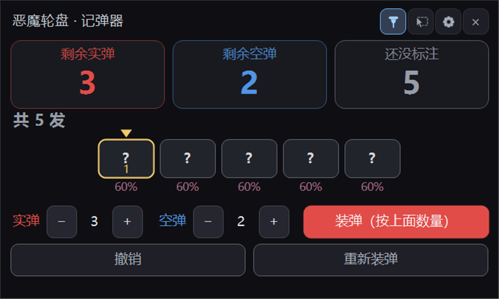

# Buckshot Roulette Shell Counter

[中文说明](README.md) | **English**

A tiny always-on-top Windows tool that tracks the shells in **Buckshot Roulette**,
so you can see **which shot is live and which is blank**, plus how many of each are left.



> Single self-contained `exe` (~33 KB). No Python, no Node, no runtime to install —
> it only needs the .NET Framework 4.8 that ships with Windows 10/11.

### Download

**[⬇ Download BuckshotCounter.exe](https://github.com/llddd13/buckshot-roulette-counter/releases/latest/download/BuckshotCounter.exe)** — just double-click, nothing to install.

You can also grab `恶魔轮盘记弹器.exe` from the repository root (same file), or build it
yourself with [`build.ps1`](build.ps1).

---

## How it works

The shell order is random every round, so you cannot memorise it — but you always know
**how many** live and blank shells were loaded, and when you fire you always **see** what came out.
This tool just keeps the book for you.

### 1. Load

Set `实弹` (live) and `空弹` (blank) to the counts the game announced, then press **装弹**.
You get that many grey "unknown" shells:

```
[?][?][?][?][?]
```

### 2. Mark

| Action | Result |
|---|---|
| **Left-click** a shell | mark it as a **live** round (red) |
| **Right-click** a shell | mark it as a **blank** round (blue) |
| Click the same colour again | back to unknown |
| **Click the FIRST shell** | treated as **fired** — it is removed and the counters drop by one |

Firing always consumes the front shell and you always see its type, so marking the first
shell is both "record" and "consume" in one click.

### 3. Probability

Under every still-unknown shell the tool shows the chance it is a live round:

```
live chance = (live left − live already marked) ÷ unknown shells
```

Colour shifts from blue (low) to red (high).

### Anti-misclick

Marking and firing have a **1 second cooldown** (the rack dims while cooling down),
so a double-click cannot cost you an extra shell. **Undo** and **Load** are exempt so you
can recover instantly.

---

## Hotkeys (work while the game is fullscreen)

| Key | Action |
|---|---|
| `Ctrl + Alt + 1` | first shell is **live** (fire & remove) |
| `Ctrl + Alt + 2` | first shell is **blank** (fire & remove) |
| `Ctrl + Alt + 3` | undo |
| `Ctrl + Alt + 4` | reload |
| `Ctrl + Alt + H` | show / hide the window |
| `Ctrl + Alt + 6` | toggle click-through |

---

## Window

```
┌──────────────────────────────────────────────┐
│ Buckshot Counter           [📌] [🖱] [⚙] [×] │  📌 pin-to-top 🖱 click-through ⚙ settings
├──────────────────────────────────────────────┤
│  live 3  │  blank 2  │  unknown 5            │
│  共 5 发                                      │
│       [?][?][?][?][?]                        │
│       60% 60% 60% 60% 60%                    │
│  实弹 [−]3[+]  空弹 [−]2[+]   [装弹]          │
│  [撤销]              [重新装弹]               │
├──────────────────────────────────────────────┤
│  使用说明 (instructions live inside settings) │
│  防误触间隔   [−] 1000 毫秒 [+]               │
│  窗口不透明度 [−] 95 %    [+]                 │
│  [窗口置顶：开][鼠标穿透：关][窗口归位]        │
└──────────────────────────────────────────────┘
```

- **📌** always-on-top — highlighted when enabled
- **🖱** click-through — **the icon itself stays clickable** (a separate tiny window sits on top of it),
  so you can never lock yourself out
- **⚙** settings, with the usage instructions at the very top

---

## Build from source

```powershell
powershell -ExecutionPolicy Bypass -File build.ps1
```

Uses the **Roslyn compiler** bundled with the .NET SDK plus the **.NET Framework 4.8**
reference assemblies. Output is a single dependency-free WinForms executable.

There is also an experimental screen-reading module (`src/RackDetector.cs`) that is
**not** compiled into the exe; run its regression tests with:

```powershell
powershell -ExecutionPolicy Bypass -File run-tests.ps1 -Dir "<folder of game screenshots>"
```

---

## Notes

- This is a **bookkeeping aid**. The multiplayer mode has its own house rules —
  follow whatever the people you play with expect.
- Game and trademark belong to Mike Klubnika. This project is unaffiliated.

MIT licensed.
